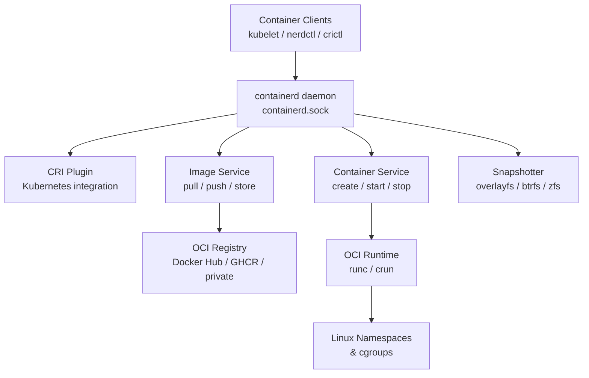

# containerd

[](https://containerd.io/)
[](https://github.com/containerd/containerd/blob/main/LICENSE)

containerd is an industry-standard container runtime with an emphasis on simplicity, robustness, and portability. It is available as a daemon for Linux and Windows, managing the complete container lifecycle of its host system: image transfer and storage, container execution and supervision, low-level storage, and network attachments.

## Features

- **OCI Compliant** - Full support for Open Container Initiative image and runtime specs
- **Snapshotter API** - Pluggable storage backends (overlayfs, btrfs, zfs, devmapper)
- **Image Management** - Pull, push, and manage container images from any OCI registry
- **Namespace Isolation** - Multiple isolated environments on a single host
- **gRPC API** - Rich, extensible API for container management
- **CRI Plugin** - Kubernetes Container Runtime Interface built-in
- **Event System** - Publish and subscribe to runtime events
- **Cross-platform** - Runs on Linux (x86_64, arm64, arm) and Windows

## Prerequisites

- Linux with systemd, OpenRC, or SysVinit, or Windows 10/11 / Server 2016+ with NSSM
- Root or sudo privileges
- Kernel 4.x+ with cgroups v1 or v2
- `runc` or `crun` OCI runtime installed
- CNI plugins (for networking)

## Architecture



## Structure

```
containerd/
├── config/              - Configuration files and templates
│   ├── config.toml      - Main containerd configuration
│   └── README.md        - Configuration documentation
├── install/             - Installation scripts and guides
│   ├── install.sh       - Installation script
│   └── README.md        - Installation instructions
├── service/             - Service definitions for different init systems
│   ├── systemd/         - systemd service unit
│   ├── openrc/          - OpenRC init script
│   ├── sysvinit/        - SysV init script
│   ├── windows/         - Windows NSSM service definition
│   └── README.md        - Service management guide
├── uninstall/           - Uninstallation scripts
│   ├── uninstall.sh     - Uninstallation script
│   └── README.md        - Uninstallation instructions
└── README.md            - This file
```

## Quick Start

### Linux (systemd)

```bash
# Install
sudo ./install/install.sh

# Copy configuration
sudo cp config/config.toml /etc/containerd/config.toml

# Start service
sudo systemctl start containerd
sudo systemctl enable containerd

# Check status
sudo systemctl status containerd
```

### Linux (OpenRC)

```bash
sudo ./install/install.sh
sudo rc-service containerd start
sudo rc-update add containerd default
```

### Linux (SysVinit)

```bash
sudo ./install/install.sh
sudo service containerd start
sudo update-rc.d containerd defaults
```

### Windows (NSSM)

```powershell
# Copy containerd to C:\containerd\
nssm install containerd "C:\containerd\containerd.exe"
nssm start containerd
```

## Configuration

See [config/README.md](config/README.md) for configuration options.

## Service Management

See [service/README.md](service/README.md) for service management across different init systems.

## Installation Guide

See [install/README.md](install/README.md) for detailed installation instructions.

## Uninstallation

See [uninstall/README.md](uninstall/README.md) for removal instructions.

## Resources

- [containerd Documentation](https://containerd.io/docs/)
- [GitHub Repository](https://github.com/containerd/containerd)
- [CRI Plugin](https://github.com/containerd/containerd/blob/main/docs/cri/config.md)
- [nerdctl CLI](https://github.com/containerd/nerdctl)
