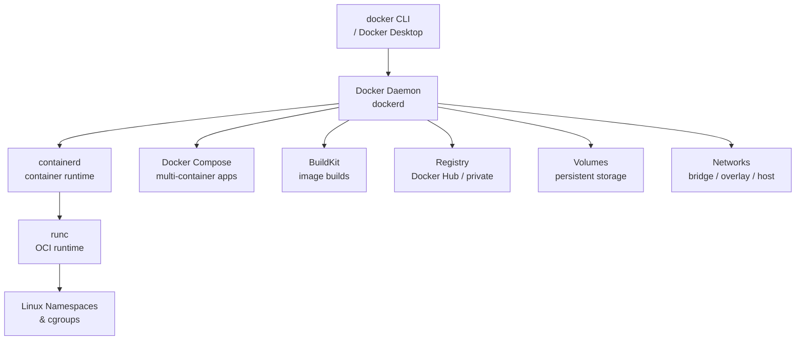

# Docker

[](https://www.docker.com/)
[](https://github.com/moby/moby/blob/master/LICENSE)

Docker is an open platform for developing, shipping, and running applications. It enables you to separate your applications from your infrastructure so you can deliver software quickly. Using Docker, you can manage your infrastructure in the same ways you manage your applications.

## Features

- **Container Engine** - Build, run, and manage containers with a simple CLI
- **Docker Compose** - Define and run multi-container applications with YAML
- **BuildKit** - High-performance image build engine with caching and parallelism
- **Docker Hub** - Registry for finding and sharing container images
- **Networking** - Built-in bridge, host, overlay, and macvlan network drivers
- **Volumes** - Persistent data management independent of container lifecycle
- **Swarm Mode** - Native clustering and orchestration for Docker containers
- **Rootless Mode** - Run Docker daemon and containers as a non-root user

## Prerequisites

- Linux with systemd, OpenRC, or SysVinit, or Windows 10/11 / Server 2016+ with NSSM
- Root or sudo privileges
- 64-bit OS, kernel 3.10+
- iptables 1.4+ and ip6tables
- Ports 2375/2376 (Docker daemon, optional remote access)

## Architecture



## Structure

```
docker/
├── config/              - Configuration files and templates
│   ├── daemon.json      - Docker daemon configuration
│   └── README.md        - Configuration documentation
├── install/             - Installation scripts and guides
│   ├── install.sh       - Installation script
│   └── README.md        - Installation instructions
├── service/             - Service definitions for different init systems
│   ├── systemd/         - systemd service unit
│   ├── openrc/          - OpenRC init script
│   ├── sysvinit/        - SysV init script
│   ├── windows/         - Windows NSSM service definition
│   └── README.md        - Service management guide
├── uninstall/           - Uninstallation scripts
│   ├── uninstall.sh     - Uninstallation script
│   └── README.md        - Uninstallation instructions
└── README.md            - This file
```

## Quick Start

### Linux (systemd)

```bash
# Install
sudo ./install/install.sh

# Copy daemon configuration
sudo mkdir -p /etc/docker
sudo cp config/daemon.json /etc/docker/daemon.json

# Start service
sudo systemctl start docker
sudo systemctl enable docker

# Check status
sudo systemctl status docker

# Run hello-world
sudo docker run hello-world
```

### Linux (OpenRC)

```bash
sudo ./install/install.sh
sudo rc-service docker start
sudo rc-update add docker default
```

### Linux (SysVinit)

```bash
sudo ./install/install.sh
sudo service docker start
sudo update-rc.d docker defaults
```

### Windows (NSSM)

```powershell
# Install Docker Desktop or Docker Engine for Windows
# Then use NSSM if running Engine headless
nssm install docker "C:\Program Files\Docker\dockerd.exe"
nssm start docker
```

## Configuration

See [config/README.md](config/README.md) for configuration options.

## Service Management

See [service/README.md](service/README.md) for service management across different init systems.

## Installation Guide

See [install/README.md](install/README.md) for detailed installation instructions.

## Uninstallation

See [uninstall/README.md](uninstall/README.md) for removal instructions.

## Resources

- [Docker Documentation](https://docs.docker.com/)
- [Docker Hub](https://hub.docker.com/)
- [GitHub Repository](https://github.com/moby/moby)
- [Docker Compose](https://docs.docker.com/compose/)
- [Docker Engine API](https://docs.docker.com/engine/api/)
