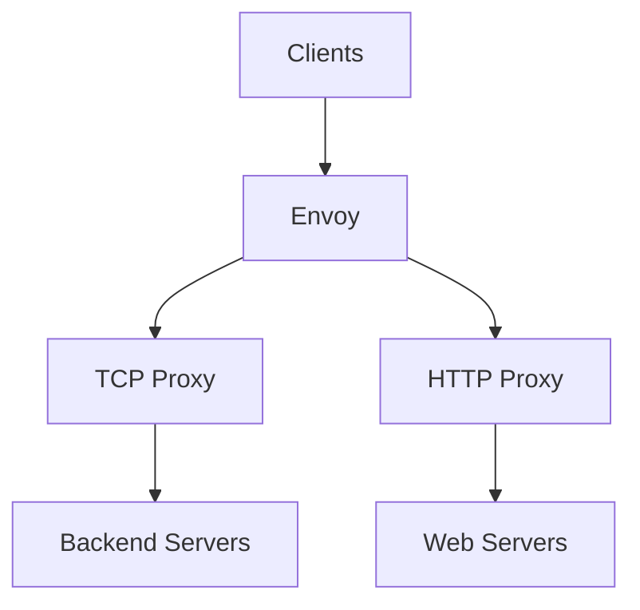

# Envoy

[](https://www.envoyproxy.io/)
[](https://github.com/envoyproxy/envoy/blob/main/LICENSE)

Envoy is a high-performance, C++ built proxy designed for large modern service-oriented architectures. It provides a uniform TCP/UDP proxying layer.

## Features

- **Layer 4 (TCP/UDP) and Layer 7 (HTTP) Proxying**
- **Automatic Service Discovery Integration**
- **Dynamic Configuration via xDS API**
- **Health Checking and Circuit Breaking**
- **Rate Limiting Integration**
- **TLS Termination with Automatic Certificate Rotation**
- **Request/Response Buffering and Rate Limiting**
- **Extensible Filter Architecture**
- **Access Logging and Tracing**

## Prerequisites

- Linux with systemd, OpenRC, or SysVinit, or Windows 10/11 / Server 2016+ with NSSM
- Root or sudo privileges
- Ports 80, 443, and 19000 (admin) open
- Envoy binary installed

## Architecture



## Structure

```
envoy/
├── config/              - Envoy configuration files
│   └── README.md        - Configuration documentation
├── install/             - Installation scripts and guides
│   └── README.md        - Installation instructions
├── service/             - Service definitions
│   ├── systemd/         - systemd service unit
│   ├── openrc/          - OpenRC init script
│   ├── sysvinit/        - SysV init script
│   ├── windows/         - Windows NSSM service definition
│   └── README.md        - Service management guide
├── uninstall/           - Uninstallation scripts
│   └── README.md        - Uninstallation instructions
└── README.md            - This file
```

## Quick Start

### Linux (systemd)

```bash
sudo ./install/install.sh
sudo cp config/envoy.yaml /etc/envoy/envoy.yaml
sudo systemctl start envoy
sudo systemctl enable envoy
sudo systemctl status envoy
```

### Linux (OpenRC)

```bash
sudo ./install/install.sh
sudo rc-service envoy start
sudo rc-update add envoy default
```

### Linux (SysVinit)

```bash
sudo ./install/install.sh
sudo service envoy start
sudo update-rc.d envoy defaults
```

### Windows (NSSM)

```powershell
nssm install envoy "C:\envoy\envoy.exe" "-c C:\envoy\envoy.yaml"
nssm start envoy
```

## Configuration

See [config/README.md](config/README.md) for configuration options.

## Service Management

See [service/README.md](service/README.md) for service management.

## Installation Guide

See [install/README.md](install/README.md) for detailed installation instructions.

## Resources

- [Envoy Documentation](https://www.envoyproxy.io/docs)
- [GitHub Repository](https://github.com/envoyproxy/envoy)
- [Envoy Architecture](https://www.envoyproxy.io/docs/envoy/latest/intro/arch_overview)