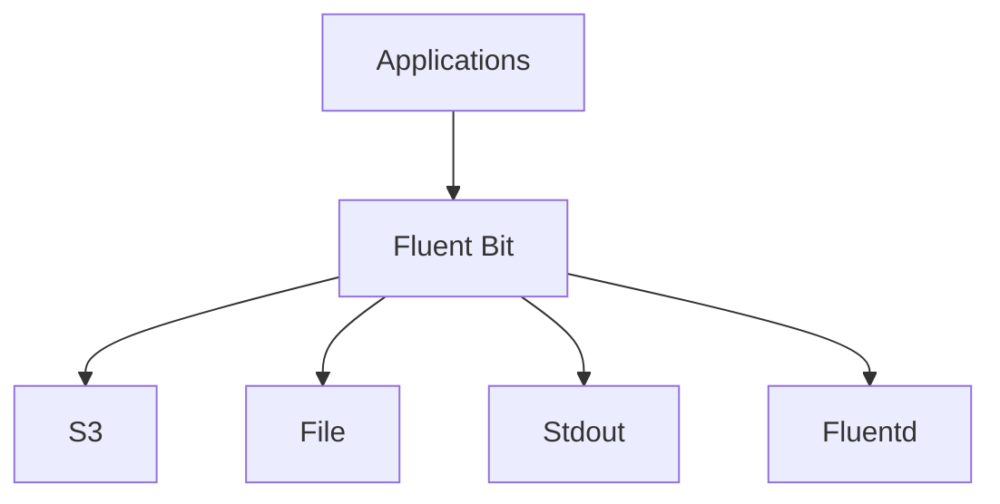

# Fluent Bit

[](https://fluentbit.fluentd.org/)
[](https://github.com/fluent/fluent-bit/blob/master/LICENSE)

Fluent Bit is a lightweight log collector and forwarder. It is designed to be used as a log collector for Fluentd and other logging systems, providing low-overhead collection and forwarding of log data.

## Features

- **Lightweight** - Minimal resource usage and footprint
- **Multiple Outputs** - Support for S3, file, stdout, and more
- **Buffering** - In-memory and disk-based buffer support
- **Log Rotation** - Built-in log file rotation
- **TCP/UDP Input** - Network input support
- **Kubernetes Friendly** - Designed for containerized environments
- **Plugin Ecosystem** - Extensive plugin system for custom processing

## Prerequisites

- Linux with systemd, OpenRC, or SysVinit, or Windows 10/11 / Server 2016+ with NSSM
- Root or sudo privileges
- Fluent Bit binary installed

## Architecture



Fluent Bit acts as a lightweight log collector sitting between applications and Fluentd or external outputs. It collects log data from various sources, buffers it, and forwards it to storage or to Fluentd for further processing.

## Structure

```
fluent-bit/
├── config/              - Configuration files and templates
│   └── README.md        - Configuration documentation
├── install/             - Installation scripts and guides
│   └── README.md        - Installation instructions
├── service/             - Service definitions for different init systems
│   ├── systemd/         - systemd service unit
│   ├── openrc/          - OpenRC init script
│   ├── sysvinit/        - SysV init script
│   ├── windows/         - Windows NSSM service definition
│   └── README.md        - Service management guide
├── uninstall/           - Uninstallation scripts
│   └── README.md        - Uninstallation instructions
└── README.md            - This file
```

## Quick Start

### Linux (systemd)

```bash
# Install
sudo ./install/install.sh

# Copy configuration
sudo cp config/fluent-bit.conf /etc/fluent-bit/fluent-bit.conf

# Start service
sudo systemctl start fluent-bit
sudo systemctl enable fluent-bit

# Check status
sudo systemctl status fluent-bit
```

### Linux (OpenRC)

```bash
sudo ./install/install.sh
sudo rc-service fluent-bit start
sudo rc-update add fluent-bit default
```

### Linux (SysVinit)

```bash
sudo ./install/install.sh
sudo service fluent-bit start
sudo update-rc.d fluent-bit defaults
```

### Windows (NSSM)

```powershell
# Copy files to C:\fluent-bit\
# Install service
nssm install fluent-bit "C:\fluent-bit\fluent-bit.exe" "-c C:\fluent-bit\fluent-bit.conf"
nssm start fluent-bit
```

## Configuration

See [config/README.md](config/README.md) for configuration options.

## Service Management

See [service/README.md](service/README.md) for service management across different init systems.

## Installation Guide

See [install/README.md](install/README.md) for detailed installation instructions.

## Uninstallation

See [uninstall/README.md](uninstall/README.md) for removal instructions.

## Resources

- [Fluent Bit Documentation](https://fluentbit.fluentd.org/)
- [Configuration Guide](https://docs.fluentbit.fluentd.org/)
- [GitHub Repository](https://github.com/fluent/fluent-bit)
- [Community Forum](https://community.fluentd.org/)