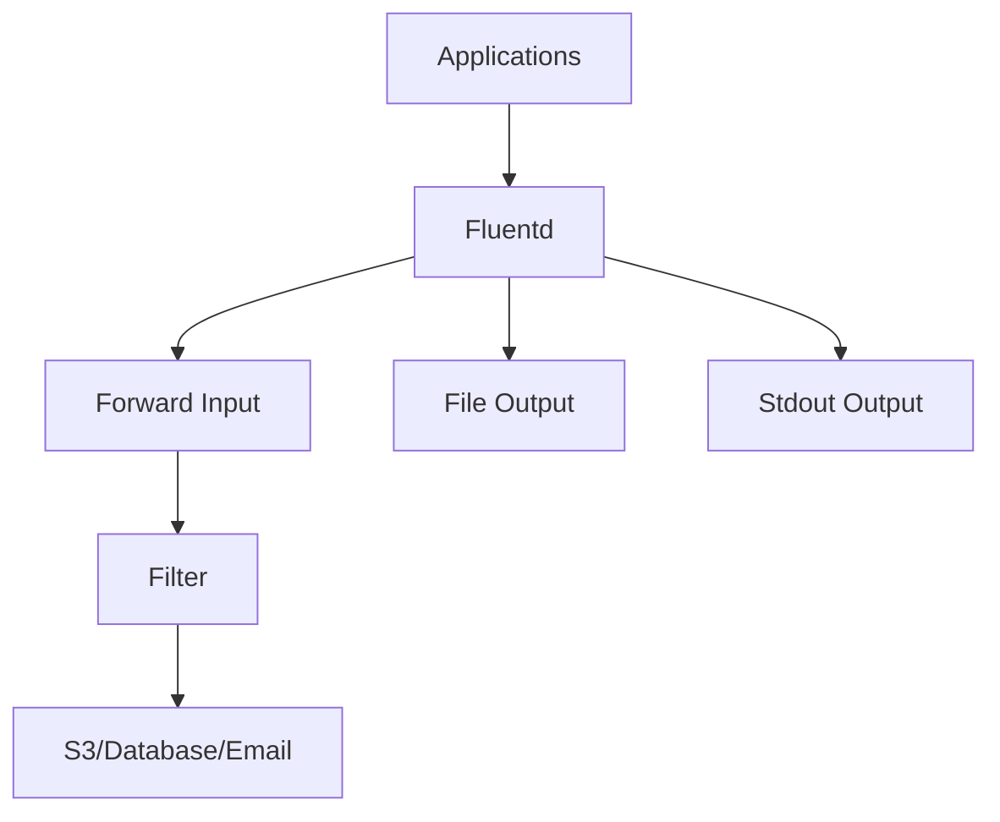

# Fluentd

[](https://www.fluentd.org/)
[](https://github.com/fluent/fluentd/blob/master/LICENSE)

Fluentd is a data collector for unified logging layer. It allows you to unify data collection and consumption for a better use and understanding of data.

## Features

- **Unified Logging Layer** - Collect data from various sources and output to multiple destinations
- **Rich Plugin Ecosystem** - Extensive input, filter, and output plugins
- **Buffering** - Memory and file-based buffering for reliability
- **TLS/SSL Support** - Secure data transmission
- **Kubernetes Native** - Built-in Kubernetes metadata collection
- **Load Balancing** - Built-in load balancing for output plugins
- **Health Checking** - Input and output health monitoring
- **Dynamic Configuration** - Hot reload without restart

## Prerequisites

- Linux with systemd, OpenRC, or SysVinit, or Windows 10/11 / Server 2016+ with NSSM
- Root or sudo privileges
- Fluentd gem or package installed
- Port 24224 (forward input) open

## Architecture



## Structure

```
fluentd/
├── config/              - Configuration files and templates
│   └── README.md        - Configuration documentation
├── install/             - Installation scripts and guides
│   └── README.md        - Installation instructions
├── service/             - Service definitions for different init systems
│   ├── systemd/         - systemd service unit
│   ├── openrc/          - OpenRC init script
│   ├── sysvinit/        - SysV init script
│   ├── windows/         - Windows NSSM service definition
│   └── README.md        - Service management guide
├── uninstall/           - Uninstallation scripts
│   └── README.md        - Uninstallation instructions
└── README.md            - This file
```

## Quick Start

### Linux (systemd)

```bash
# Install
sudo ./install/install.sh

# Copy configuration
sudo cp config/fluentd.conf /etc/fluentd/fluentd.conf

# Start service
sudo systemctl start fluentd
sudo systemctl enable fluentd

# Check status
sudo systemctl status fluentd
```

### Linux (OpenRC)

```bash
sudo ./install/install.sh
sudo rc-service fluentd start
sudo rc-update add fluentd default
```

### Linux (SysVinit)

```bash
sudo ./install/install.sh
sudo service fluentd start
sudo update-rc.d fluentd defaults
```

### Windows (NSSM)

```powershell
# Copy files to C:\fluentd\
# Install service
nssm install fluentd "C:\fluentd\bin\fluentd.exe" "-c C:\fluentd\fluentd.conf"
nssm start fluentd
```

## Configuration

See [config/README.md](config/README.md) for configuration options.

## Service Management

See [service/README.md](service/README.md) for service management across different init systems.

## Installation Guide

See [install/README.md](install/README.md) for detailed installation instructions.

## Uninstallation

See [uninstall/README.md](uninstall/README.md) for removal instructions.

## Resources

- [Fluentd Documentation](https://docs.fluentd.org/)
- [Getting Started Guide](https://www.fluentd.org/guide)
- [Plugin Catalog](https://www.fluentd.org/plugins)
- [GitHub Repository](https://github.com/fluent/fluentd)
- [Community Forum](https://community.fluentd.org/)