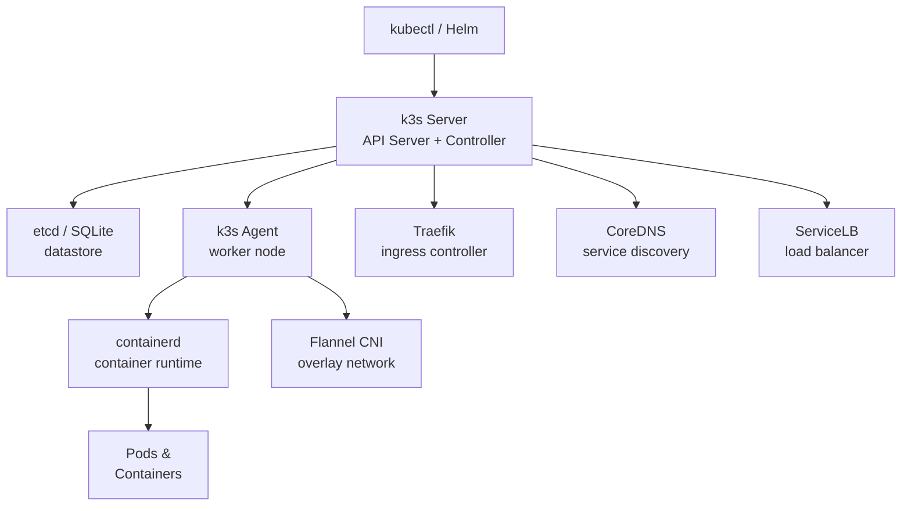

# k3s

[](https://k3s.io/)
[](https://github.com/k3s-io/k3s/blob/master/LICENSE)

k3s is a lightweight, certified Kubernetes distribution designed for production workloads in resource-constrained environments such as edge computing, IoT, CI, and ARM devices. It packages Kubernetes into a single binary under 100MB with minimal dependencies.

## Features

- **Single Binary** - All Kubernetes components packaged in one binary
- **Low Resource Usage** - Runs on 512MB RAM; ideal for edge and IoT
- **Built-in Container Runtime** - Uses containerd by default
- **Embedded SQLite** - Default datastore; supports etcd, PostgreSQL, MySQL
- **Auto TLS** - Automatic certificate management for all components
- **Helm Controller** - Deploy Helm charts via CRDs
- **Traefik Ingress** - Built-in Traefik ingress controller
- **ServiceLB** - Built-in load balancer using Klipper
- **Local Path Provisioner** - Simple persistent volume provisioner
- **ARM Support** - Runs on ARM64, ARMv7, and x86_64

## Prerequisites

- Linux with systemd or OpenRC
- 512 MB RAM minimum (1 GB recommended for agents)
- 200 MB disk for the binary
- Root or sudo privileges
- Kernel 5.4+ recommended; cgroups v2 supported
- Ports: 6443 (API), 10250 (kubelet), 8472/UDP (Flannel VXLAN), 51820/UDP (WireGuard, optional)

## Architecture



## Structure

```
k3s/
├── config/              - Configuration files and templates
│   ├── config.yaml      - k3s server/agent configuration
│   └── README.md        - Configuration documentation
├── install/             - Installation scripts and guides
│   ├── install.sh       - Installation script
│   └── README.md        - Installation instructions
├── service/             - Service definitions for different init systems
│   ├── systemd/         - systemd service unit
│   ├── openrc/          - OpenRC init script
│   ├── sysvinit/        - SysV init script
│   ├── windows/         - Windows NSSM service definition
│   └── README.md        - Service management guide
├── uninstall/           - Uninstallation scripts
│   ├── uninstall.sh     - Uninstallation script
│   └── README.md        - Uninstallation instructions
└── README.md            - This file
```

## Quick Start

### Linux (systemd) — Single Node

```bash
# Install k3s server
sudo ./install/install.sh

# Check status
sudo systemctl status k3s

# Use kubectl
sudo k3s kubectl get nodes
sudo k3s kubectl get pods -A

# Export kubeconfig
sudo cp /etc/rancher/k3s/k3s.yaml ~/.kube/config
sudo chown $USER ~/.kube/config
```

### Add an Agent Node

```bash
# Get server token
sudo cat /var/lib/rancher/k3s/server/node-token

# On agent node (replace SERVER_IP and TOKEN)
K3S_URL=https://SERVER_IP:6443 K3S_TOKEN=TOKEN sudo ./install/install.sh --agent
```

### Linux (OpenRC)

```bash
sudo ./install/install.sh
sudo rc-service k3s start
sudo rc-update add k3s default
```

### Linux (SysVinit)

```bash
sudo ./install/install.sh
sudo service k3s start
sudo update-rc.d k3s defaults
```

### Windows

k3s does not run natively on Windows. Use WSL2 or a Linux VM for Windows environments.

## Configuration

See [config/README.md](config/README.md) for configuration options.

## Service Management

See [service/README.md](service/README.md) for service management across different init systems.

## Installation Guide

See [install/README.md](install/README.md) for detailed installation instructions.

## Uninstallation

See [uninstall/README.md](uninstall/README.md) for removal instructions.

## Resources

- [k3s Documentation](https://docs.k3s.io/)
- [GitHub Repository](https://github.com/k3s-io/k3s)
- [k3s Helm Charts](https://github.com/k3s-io/helm-charts)
- [Rancher k3s](https://www.rancher.com/products/k3s)
