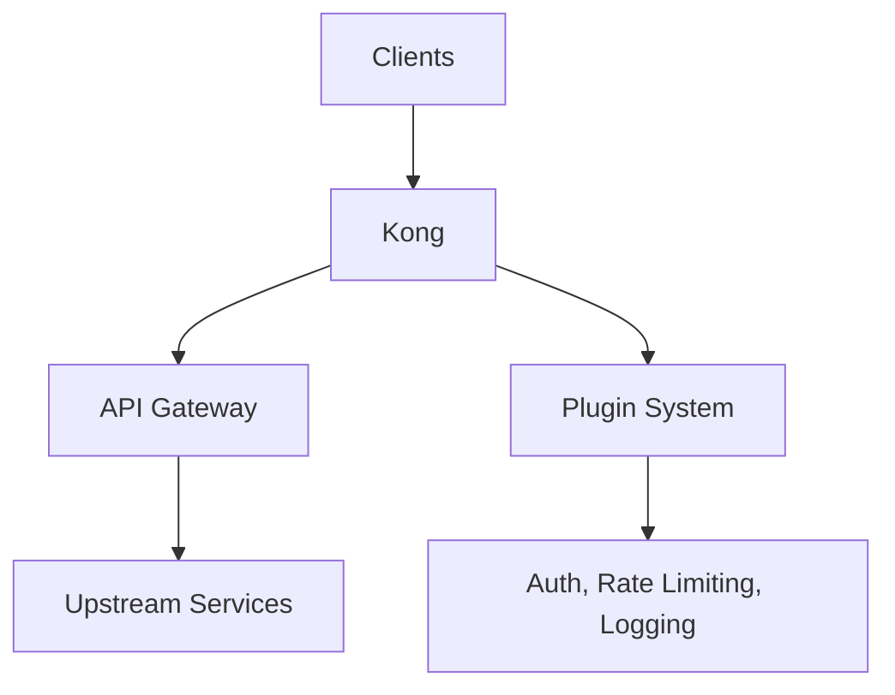

# Kong

[](https://konghq.com/)
[](https://github.com/Kong/kong/blob/master/LICENSE)

Kong is a cloud-native, fast, scalable, and dynamic API Gateway built on top of Nginx. It provides layer 7 proxying, authentication, rate limiting, and more.

## Features

- **API Gateway** - Centralized API management
- **Plugins** - Extensible plugin system (auth, logging, rate limiting, CORS, etc.)
- **Kong Enterprise** - Advanced features including developer portal, analytics, and more
- **Upstream & Service Discovery** - Dynamic upstream management
- **Health Checks** - Active and passive health checking
- **Rate Limiting** - Per-consumer, per-service rate limits
- **Authentication** - Key-auth, OAuth2, JWT, OpenID Connect, ACL, and more
- **Circuit Breaking** - Fault tolerance
- **Logging** - HTTP/log, file, syslog, and external services

## Prerequisites

- Linux with systemd, OpenRC, or SysVinit, or Windows 10/11 / Server 2016+ with NSSM
- Root or sudo privileges
- Ports 8000, 8443, 8001 (Admin API), and 8002 (Manager API)
- PostgreSQL or Cassandra database
- Docker recommended for production

## Architecture



## Structure

```
kong/
├── config/              - Kong configuration files
│   └── README.md        - Configuration documentation
├── install/             - Installation scripts and guides
│   └── README.md        - Installation instructions
├── service/             - Service definitions
│   ├── systemd/         - systemd service unit
│   ├── openrc/          - OpenRC init script
│   ├── sysvinit/        - SysV init script
│   ├── windows/         - Windows NSSM service definition
│   └── README.md        - Service management guide
├── uninstall/           - Uninstallation scripts
│   └── README.md        - Uninstallation instructions
└── README.md            - This file
```

## Quick Start

### Linux (systemd)

```bash
sudo ./install/install.sh
sudo cp config/kong.conf /etc/kong/kong.conf
sudo kong migrations up
sudo systemctl start kong
sudo systemctl enable kong
sudo systemctl status kong
```

### Linux (OpenRC)

```bash
sudo ./install/install.sh
sudo kong migrations up
sudo rc-service kong start
sudo rc-update add kong default
```

### Linux (SysVinit)

```bash
sudo ./install/install.sh
sudo kong migrations up
sudo service kong start
sudo update-rc.d kong defaults
```

### Windows (NSSM)

```powershell
nssm install kong "C:\kong\kong" "start"
nssm start kong
```

## Configuration

See [config/README.md](config/README.md) for configuration options.

## Service Management

See [service/README.md](service/README.md) for service management.

## Installation Guide

See [install/README.md](install/README.md) for detailed installation instructions.

## Resources

- [Kong Documentation](https://docs.konghq.com/)
- [Kong Hub (Plugins)](https://hub.konghq.com/)
- [GitHub Repository](https://github.com/Kong/kong)
- [Kong Enterprise](https://konghq.com/products/kong-enterprise/)