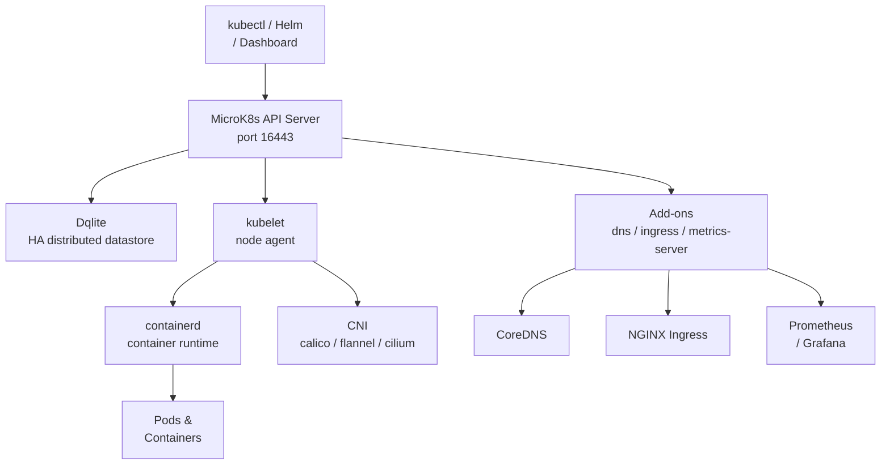

# MicroK8s

[](https://microk8s.io/)
[](https://github.com/canonical/microk8s/blob/master/LICENSE)

MicroK8s is a low-ops, minimal production Kubernetes distribution from Canonical. It runs as a single snap package, delivering a fully conformant Kubernetes cluster on any Linux machine, with a curated addon system for storage, networking, monitoring, and more.

## Features

- **Zero-ops Install** - Single `snap install microk8s` command
- **Add-ons** - Curated add-ons: DNS, dashboard, ingress, Prometheus, Istio, Knative, and more
- **Multi-node** - Join nodes with a single command for HA clusters
- **High Availability** - Built-in HA with Dqlite (distributed SQLite)
- **GPU Support** - NVIDIA GPU passthrough add-on
- **Registry** - Built-in private container registry
- **Strict Confinement** - Optional snap strict mode for hardened environments
- **ARM Support** - Runs on ARM64, ARM32, and x86_64

## Prerequisites

- Ubuntu 20.04+ / Debian / Fedora / OpenSUSE or any Snap-supported Linux
- Snap package manager installed
- 4 GB RAM recommended (2 GB minimum)
- 20 GB disk space
- Root or sudo privileges
- Ports: 16443 (API), 10250 (kubelet), 10255 (read-only kubelet), 25000 (cluster agent)

## Architecture



## Structure

```
microk8s/
├── config/              - Configuration files and templates
│   ├── microk8s.yaml    - MicroK8s cluster configuration reference
│   └── README.md        - Configuration documentation
├── install/             - Installation scripts and guides
│   ├── install.sh       - Installation script
│   └── README.md        - Installation instructions
├── service/             - Service definitions for different init systems
│   ├── systemd/         - systemd service unit
│   ├── openrc/          - OpenRC init script
│   ├── sysvinit/        - SysV init script
│   ├── windows/         - Windows NSSM service definition
│   └── README.md        - Service management guide
├── uninstall/           - Uninstallation scripts
│   ├── uninstall.sh     - Uninstallation script
│   └── README.md        - Uninstallation instructions
└── README.md            - This file
```

## Quick Start

### Linux (snap)

```bash
# Install
sudo ./install/install.sh

# Check status
microk8s status --wait-ready

# Use kubectl
microk8s kubectl get nodes
microk8s kubectl get pods -A

# Enable essential add-ons
microk8s enable dns ingress metrics-server

# Export kubeconfig
microk8s config > ~/.kube/config
```

### Add a Node to the Cluster

```bash
# On the primary node — generate join token
microk8s add-node

# On the joining node — run the printed join command
microk8s join <primary-ip>:25000/<token>
```

### Linux (OpenRC — via snap)

```bash
sudo ./install/install.sh
sudo rc-service snap.microk8s.daemon-kubelite start
```

### Windows / macOS

Install [Multipass](https://multipass.run/) and use MicroK8s inside a VM:

```powershell
multipass launch --name microk8s --mem 4G --disk 20G
multipass exec microk8s -- sudo snap install microk8s --classic
```

## Configuration

See [config/README.md](config/README.md) for configuration options.

## Service Management

See [service/README.md](service/README.md) for service management across different init systems.

## Installation Guide

See [install/README.md](install/README.md) for detailed installation instructions.

## Uninstallation

See [uninstall/README.md](uninstall/README.md) for removal instructions.

## Resources

- [MicroK8s Documentation](https://microk8s.io/docs)
- [GitHub Repository](https://github.com/canonical/microk8s)
- [Add-on Catalogue](https://microk8s.io/docs/addons)
- [Multi-node Setup](https://microk8s.io/docs/clustering)
