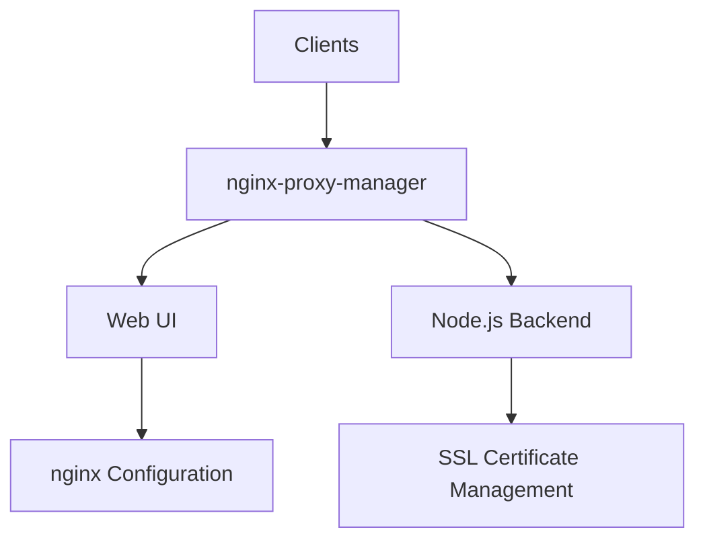

# nginx-proxy-manager

A GUI-based reverse proxy manager built on Node.js and Nginx, featuring an intuitive web interface for managing reverse proxies, SSL certificates, and host configurations.

## Prerequisites

- Linux with systemd, OpenRC, or SysVinit, or Windows 10/11 / Server 2016+ with NSSM
- Root or sudo privileges
- Port 80 and 443 open
- Node.js installed

## Architecture



## Structure

- `config/` — Configuration files and templates
  - `npm.yaml` — NPM runtime configuration
  - `README.md` — Configuration documentation
- `service/` — Service definitions for different init systems
  - `systemd/` — systemd service units
  - `openrc/` — OpenRC init scripts
  - `sysvinit/` — SysV init scripts
  - `windows/` — Windows service definitions (NSSM)
  - `README.md` — Service management guide
- `install/` — Installation scripts and guides
  - `install.sh` — Automated installation script
  - `README.md` — Installation documentation
- `uninstall/` — Uninstallation scripts
  - `uninstall.sh` — Automated uninstallation script
  - `README.md` — Uninstallation documentation

## Quick Start

### systemd (Linux)

```bash
cp service/systemd/nginx-proxy-manager.service /etc/systemd/system/
cp config/npm.yaml /etc/nginx-proxy-manager/npm.yaml
systemctl daemon-reload
systemctl enable nginx-proxy-manager
systemctl start nginx-proxy-manager
```

### OpenRC (Alpine/Gentoo)

```bash
cp service/openrc/nginx-proxy-manager /etc/init.d/nginx-proxy-manager
chmod +x /etc/init.d/nginx-proxy-manager
rc-update add nginx-proxy-manager default
rc-service nginx-proxy-manager start
```

### SysVinit (Debian/older)

```bash
cp service/sysvinit/nginx-proxy-manager /etc/init.d/nginx-proxy-manager
chmod +x /etc/init.d/nginx-proxy-manager
update-rc.d nginx-proxy-manager defaults
service nginx-proxy-manager start
```

### Windows (NSSM)

```powershell
copy service\windows\nginx-proxy-manager.nssm C:\ProgramData\nginx-proxy-manager\
copy config\npm.yaml C:\etc\nginx-proxy-manager\npm.yaml
nssm install nginx-proxy-manager "C:\Program Files\nodejs\node.exe" "C:\lib\nginx-proxy-manager\start.js"
nssm start nginx-proxy-manager
```

### Verify

Open http://localhost:81 in your browser and log in with the default credentials:

- **Email:** `admin@example.com`
- **Password:** `changeme`

## Configuration

See [config/README.md](config/README.md) for configuration options and [config/npm.yaml](config/npm.yaml) for the default configuration file.

## Service Management

See [service/README.md](service/README.md) for service management across different init systems.

## Installation

See [install/README.md](install/README.md) for detailed installation instructions.

## Uninstallation

See [uninstall/README.md](uninstall/README.md) for uninstallation instructions.
