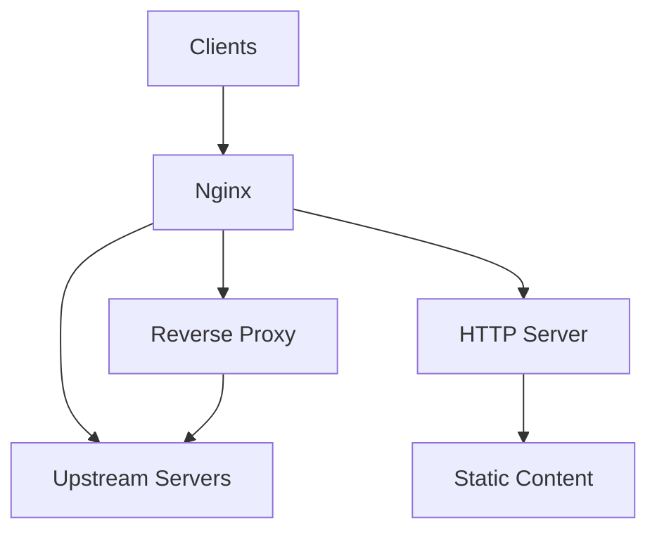

# nginx

[](https://nginx.com/)

## nginx - High-Performance Web Server and Reverse Proxy

nginx [engine x] is a high-performance web server and reverse proxy server. It can be used as a web server (HTTP, HTTPS, SMTP/POP3/IMAP), as a reverse proxy for TCP, UDP, Unix sockets and as a load balancer and HTTP cache.

## Features

- **Reverse Proxy** - Proxy requests to upstream servers with load balancing
- **HTTP Cache** - Built-in cache for accelerating content delivery
- **Load Balancing** - Round-robin, least-connections, IP-hash and other methods
- **SSL/TLS Termination** - Supported with various certificate formats
- **Gzip Compression** - Reduce response size for text-based content
- **Security Headers** - HSTS, X-Frame-Options, X-Content-Type-Options
- **Virtual Hosting** - Multiple websites on single IP address
- **WebSocket Support** - Proxying and caching
- **Health Checks** - Automatic upstream health monitoring
- **Dynamic Configuration** - Reload configuration without downtime

## Architecture



## Structure

```
nginx/
├── config/              - Configuration files and templates
│   └── README.md        - Configuration documentation
├── install/             - Installation scripts and guides
│   └── README.md        - Installation instructions
├── service/             - Service definitions for different init systems
│   ├── systemd/         - systemd service unit
│   ├── openrc/          - OpenRC init script
│   ├── sysvinit/        - SysV init script
│   └── windows/         - Windows NSSM service definition
│   └── README.md        - Service management guide
├── uninstall/           - Uninstallation scripts
│   └── README.md        - Uninstallation instructions
└── README.md            - This file
```

## Quick Start

### Linux (systemd)

```bash
# Copy service file
sudo cp service/systemd/nginx.service /etc/systemd/system/

# Copy configuration
sudo cp config/nginx.conf /etc/nginx/nginx.conf

# Reload and enable
sudo systemctl daemon-reload
sudo systemctl enable nginx

# Start service
sudo systemctl start nginx

# Check status
sudo systemctl status nginx
```

### Linux (OpenRC)

```bash
# Copy init script
sudo cp service/openrc/nginx /etc/init.d/

# Make executable
sudo chmod +x /etc/init.d/nginx

# Add to default runlevel
sudo rc-update add nginx default

# Start service
sudo rc-service nginx start

# Check status
sudo rc-service nginx status
```

### Linux (SysVinit)

```bash
# Copy init script
sudo cp service/sysvinit/nginx /etc/init.d/

# Make executable
sudo chmod +x /etc/init.d/nginx

# Add to startup
sudo chkconfig --add nginx
sudo chkconfig nginx on

# Start service
sudo service nginx start

# Check status
sudo service nginx status
```

### Windows (NSSM)

```cmd
# Copy files to C:\nginx\
copy service\windows\nginx.nssm C:\nginx\nginx.nssm
copy config\nginx.conf C:\nginx\nginx.conf

# Install service
nssm install nginx C:\nginx\nginx.exe

# Start service
nssm start nginx
```

## Configuration

See [config/README.md](config/README.md) for detailed configuration options including:
- server block directives
- location blocks
- upstream configurations
- SSL/TLS setup
- caching parameters

## Service Management

See [service/README.md](service/README.md) for service management across different init systems:
- Starting and stopping services
- Viewing logs
- Reloading configuration
- Enabling/disabling on boot

## Installation

See [install/README.md](install/README.md) for detailed installation guides:
- Package manager installation (apt, dnf, etc.)
- Binary installation from source
- Docker installation
- Windows NSSM installation

## Uninstallation

See [uninstall/README.md](uninstall/README.md) for removal instructions:
- Stopping and disabling services
- Removing packages
- Cleaning up configuration files

## Resources

- [nginx Documentation](https://nginx.com/resources/wiki/);
- [nginx Configuring NGINX](https://nginx.com/resources/admin-guide/);
- [nginx HTTP Module](https://nginx.com/resources/developers-guide/);
- [nginx Lua Module](https://openresty.org/en/);
- [nginx Community Forum](https://nginx.com/resources/forum/);