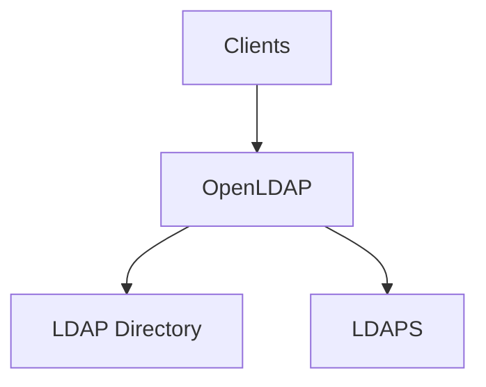

# OpenLDAP

[](https://www.openldap.org/)
[](https://www.openldap.org/software/release/license.html)

OpenLDAP is a free, open-source implementation of the Lightweight Directory Access Protocol (LDAP). It provides a robust, scalable directory service for storing and retrieving user accounts, groups, and other structured data, commonly used as the authentication and directory backend for Linux environments, applications, and identity platforms.

## Features

- **Standards Compliant** - Full LDAPv3 implementation with RFC-compliant schema support
- **MDB Backend** - Lightning Memory-Mapped Database (LMDB) for high-performance storage
- **TLS / LDAPS** - Native TLS encryption for secure directory communications
- **SASL Authentication** - Pluggable SASL support including GSSAPI (Kerberos) and DIGEST-MD5
- **Access Control Lists** - Granular ACLs to control read/write access per entry and attribute
- **Replication** - Syncrepl-based multi-provider replication for high availability
- **Overlays** - Modular overlay system for ppolicy, memberOf, auditlog, and more
- **Schema Extensibility** - Define custom object classes and attributes to fit any data model

## Prerequisites

- Linux with systemd, OpenRC, or SysVinit, or Windows 10/11 / Server 2016+ with NSSM
- Root or sudo privileges
- Ports 389 (LDAP) and 636 (LDAPS) open

## Architecture



## Structure

```
openldap/
├── config/              - Configuration files and templates
│   └── README.md        - Configuration documentation
├── install/             - Installation scripts and guides
│   └── README.md        - Installation instructions
├── service/             - Service definitions for different init systems
│   ├── systemd/         - systemd service unit
│   ├── openrc/          - OpenRC init script
│   ├── sysvinit/        - SysV init script
│   ├── windows/         - Windows NSSM service definition
│   └── README.md        - Service management guide
├── uninstall/           - Uninstallation scripts
│   └── README.md        - Uninstallation instructions
└── README.md            - This file
```

## Quick Start

### Linux (systemd)

```bash
# Install
sudo ./install/install.sh

# Copy configuration
sudo cp config/slapd.conf /etc/openldap/slapd.conf

# Start service
sudo systemctl start slapd
sudo systemctl enable slapd

# Check status
sudo systemctl status slapd
```

### Linux (OpenRC)

```bash
sudo ./install/install.sh
sudo rc-service slapd start
sudo rc-update add slapd default
```

### Linux (SysVinit)

```bash
sudo ./install/install.sh
sudo service slapd start
sudo update-rc.d slapd defaults
```

### Windows (NSSM)

```powershell
# Copy OpenLDAP to C:\openldap\
# Install service
nssm install slapd "C:\openldap\libexec\slapd.exe" "-f C:\openldap\etc\openldap\slapd.conf -h ldap:///"
nssm set slapd AppDirectory "C:\openldap"
nssm start slapd
```

## Configuration

See [config/README.md](config/README.md) for configuration options.

## Service Management

See [service/README.md](service/README.md) for service management across different init systems.

## Installation Guide

See [install/README.md](install/README.md) for detailed installation instructions.

## Uninstallation

See [uninstall/README.md](uninstall/README.md) for removal instructions.

## Resources

- [OpenLDAP Documentation](https://www.openldap.org/doc/)
- [Administrator's Guide](https://www.openldap.org/doc/admin26/)
- [OpenLDAP Project](https://www.openldap.org/)
- [Schema Reference](https://www.openldap.org/doc/admin26/schema.html)
