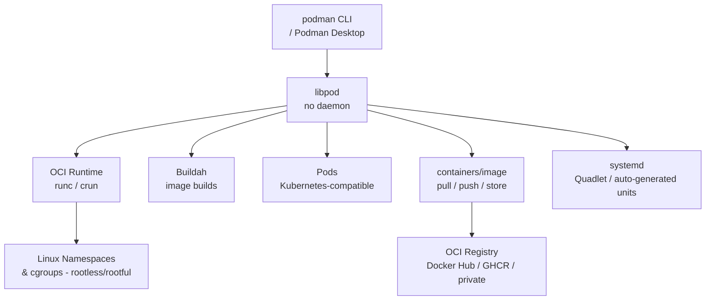

# Podman

[](https://podman.io/)
[](https://github.com/containers/podman/blob/main/LICENSE)

Podman is a daemonless, rootless container engine for developing, managing, and running OCI Containers on your Linux system. It provides a Docker-compatible CLI and can run containers as a non-root user without a central daemon process.

## Features

- **Daemonless** - No central daemon; each container is a direct child process
- **Rootless** - Run containers as a non-root user for better security
- **Docker-compatible CLI** - Drop-in replacement for most `docker` commands
- **Pods** - Native support for Kubernetes-style pod groupings
- **systemd Integration** - Auto-generate systemd units with `podman generate systemd`
- **Buildah Integration** - Build OCI and Docker images natively
- **Skopeo Integration** - Copy and inspect images across registries
- **Quadlet** - Declarative container management via systemd `.container` unit files

## Prerequisites

- Linux with systemd, OpenRC, or SysVinit (Windows via WSL2 or Podman Desktop)
- Root or sudo privileges (for system-wide install; rootless works without)
- Kernel 3.8+ with user namespace support
- `newuidmap` / `newgidmap` for rootless usage (`shadow-utils` / `uidmap` package)

## Architecture



## Structure

```
podman/
├── config/              - Configuration files and templates
│   ├── containers.conf  - Main Podman/containers configuration
│   ├── registries.conf  - Registry search and mirror configuration
│   └── README.md        - Configuration documentation
├── install/             - Installation scripts and guides
│   ├── install.sh       - Installation script
│   └── README.md        - Installation instructions
├── service/             - Service definitions for different init systems
│   ├── systemd/         - systemd service unit
│   ├── openrc/          - OpenRC init script
│   ├── sysvinit/        - SysV init script
│   ├── windows/         - Windows NSSM service definition
│   └── README.md        - Service management guide
├── uninstall/           - Uninstallation scripts
│   ├── uninstall.sh     - Uninstallation script
│   └── README.md        - Uninstallation instructions
└── README.md            - This file
```

## Quick Start

### Linux (systemd) — rootless

```bash
# Install
sudo ./install/install.sh

# Start Podman socket for rootless user (Docker API compatibility)
systemctl --user enable --now podman.socket

# Run a container
podman run hello-world

# Check status
systemctl --user status podman.socket
```

### Linux (systemd) — rootful

```bash
sudo systemctl enable --now podman.socket
sudo podman run hello-world
```

### Linux (OpenRC)

```bash
sudo ./install/install.sh
sudo rc-service podman start
sudo rc-update add podman default
```

### Linux (SysVinit)

```bash
sudo ./install/install.sh
sudo service podman start
sudo update-rc.d podman defaults
```

### Windows (via Podman Desktop or WSL2)

```powershell
# Install Podman Desktop from https://podman-desktop.io/
# Or use WSL2 with the Linux install steps above
podman machine init
podman machine start
podman run hello-world
```

## Configuration

See [config/README.md](config/README.md) for configuration options.

## Service Management

See [service/README.md](service/README.md) for service management across different init systems.

## Installation Guide

See [install/README.md](install/README.md) for detailed installation instructions.

## Uninstallation

See [uninstall/README.md](uninstall/README.md) for removal instructions.

## Resources

- [Podman Documentation](https://docs.podman.io/)
- [GitHub Repository](https://github.com/containers/podman)
- [Podman Desktop](https://podman-desktop.io/)
- [Quadlet Guide](https://docs.podman.io/en/latest/markdown/podman-systemd.unit.5.html)
- [Rootless Podman](https://github.com/containers/podman/blob/main/docs/tutorials/rootless_tutorial.md)
