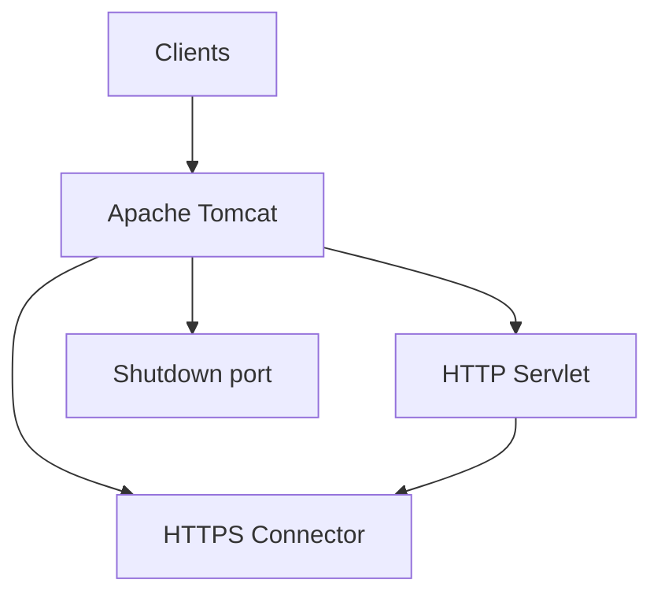

# Tomcat

[](https://tomcat.apache.org/)
[](https://github.com/apache/tomcat/blob/LICENSE)

Apache Tomcat is an open-source implementation of the Jakarta Servlet, Jakarta Server Pages, Jakarta Expression Language, and WebSocket technologies.

## Features

- **Java servlet container** - Full Jakarta Servlet specification support
- **JSP** - JavaServer Pages support
- **WebSocket** - WebSocket protocol support
- **Clustering** - Horizontal scaling support
- **SSL/TLS** - Secure communication support
- **Virtual hosting** - Multiple sites on a single instance

## Prerequisites

- Linux with systemd, OpenRC, or SysVinit, or Windows 10/11 / Server 2016+ with NSSM
- Root or sudo privileges
- Port 8080 (HTTP), 8443 (HTTPS), 8005 (shutdown)
- Java installed on the system

## Architecture



## Structure

```
tomcat/
├── config/              - Tomcat configuration files
│   ├── server.xml       - Main server configuration
│   ├── tomcat-users.xml - User and role definitions
│   └── README.md        - Configuration documentation
├── install/             - Installation scripts and guides
│   └── README.md        - Installation instructions
├── service/             - Service definitions
│   ├── systemd/         - systemd service unit
│   ├── openrc/          - OpenRC init script
│   ├── sysvinit/        - SysV init script
│   ├── windows/         - Windows NSSM service definition
│   └── README.md        - Service management guide
├── uninstall/           - Uninstallation scripts
│   └── README.md        - Uninstallation instructions
└── README.md            - This file
```

## Quick Start

### Linux (systemd)

```bash
sudo ./install/install.sh
sudo cp config/server.xml /etc/tomcat/server.xml
sudo systemctl start tomcat
sudo systemctl enable tomcat
sudo systemctl status tomcat
```

### Linux (OpenRC)

```bash
sudo ./install/install.sh
sudo rc-service tomcat start
sudo rc-update add tomcat default
```

### Linux (SysVinit)

```bash
sudo ./install/install.sh
sudo service tomcat start
sudo chkconfig --add tomcat
sudo chkconfig tomcat on
```

### Windows (NSSM)

```powershell
nssm install tomcat "C:\tomcat\bin\catalina.bat" "run"
nssm start tomcat
```

## Configuration

See [config/README.md](config/README.md) for configuration options.

## Service Management

See [service/README.md](service/README.md) for service management across different init systems.

## Installation

See [install/README.md](install/README.md) for installation instructions.

## Uninstallation

See [uninstall/README.md](uninstall/README.md) for uninstallation instructions.