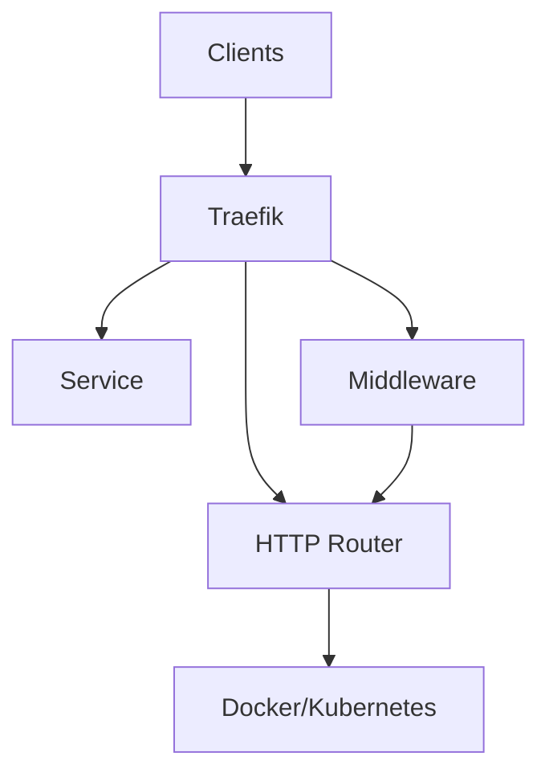

# traefik

System service collection for traefik — a modern HTTP reverse proxy and load balancer.

## Features

- Automatic service discovery (Docker, Kubernetes, file-based)
- Let's Encrypt integration with automatic certificate management
- Dynamic middleware support (rate limiting, retry, circuit breaker, basic auth)
- WebAssembly (WASM) support for custom plugins
- Metrics export (Prometheus, Datadog, StatsD)
- Multi-platform support: systemd, OpenRC, SysVinit, Windows NSSM

## Architecture



## Structure

- `config/` — Configuration files and templates
  - `traefik.yml` — Main Traefik YAML configuration
  - `README.md` — Configuration documentation
- `install/` — Installation scripts and guides
  - `install.sh` — Automated installation script
  - `README.md` — Installation guide
- `service/` — Service definitions for different init systems
  - `systemd/traefik.service` — systemd service unit
  - `openrc/traefik` — OpenRC init script
  - `sysvinit/traefik` — SysVinit init script
  - `windows/traefik.nssm` — Windows NSSM configuration
  - `README.md` — Service management guide
- `uninstall/` — Uninstallation scripts
  - `uninstall.sh` — Automated uninstallation script
  - `README.md` — Uninstallation guide

## Quick Start

### systemd (Linux)

```bash
sudo cp config/traefik.yml /etc/traefik/traefik.yml
sudo cp service/systemd/traefik.service /etc/systemd/system/traefik.service
sudo systemctl daemon-reload
sudo systemctl enable traefik
sudo systemctl start traefik
```

### OpenRC (Alpine, Gentoo)

```bash
sudo cp config/traefik.yml /etc/traefik/traefik.yml
sudo cp service/openrc/traefik /etc/init.d/traefik
chmod +x /etc/init.d/traefik
rc-update add traefik default
rc-service traefik start
```

### SysVinit (Debian, older Ubuntu)

```bash
sudo cp config/traefik.yml /etc/traefik/traefik.yml
sudo cp service/sysvinit/traefik /etc/init.d/traefik
chmod +x /etc/init.d/traefik
update-rc.d traefik defaults
service traefik start
```

### Windows

```powershell
copy config\traefik.yml C:\etc\traefik\traefik.yml
copy service\windows\traefik.nssm C:\etc\traefik\traefik.nssm
nssm install traefik "C:\usr\local\bin\traefik.exe" --configFile=C:\etc\traefik\traefik.yml
nssm start traefik
```

## Dashboard

The Traefik dashboard is available at [http://localhost:8080](http://localhost:8080).

## Ports

| Port | Purpose            |
|------|--------------------|
| 80   | HTTP entry point   |
| 443  | HTTPS entry point  |
| 8080 | Dashboard / API    |

## Default Credentials

The dashboard uses the credentials configured in `config/traefik.yml`. Set the `dashboard` section under `api` to customize.

## Sub-READMEs

- [Configuration](config/README.md)
- [Service Management](service/README.md)
- [Installation](install/README.md)
- [Uninstallation](uninstall/README.md)

## License

See the main repository license for details.
